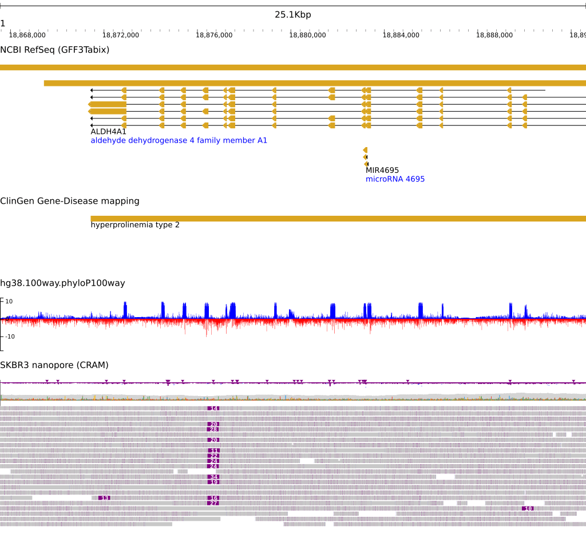

# jb2export

Static exports of JBrowse 2 rendering. This is a proof of concept work in
progress using beta branches of JBrowse 2 but has some nice early results

The output is currently svg which can be converted to png if needed

## Setup

Note that this is not yet published to NPM but when it is you can install via

```bash
npm install -g jb2export
```

Then you will have a command `jb2export` that can be used.

To use it now, see [developer guide](DEVELOPER.md) for details

## Example usages

```bash
## prepare local files
samtools faidx yourfile.fa # generates yourfile.fa.fai
samtools index yourfile.bam # generates yourfile.bam.bai


## simple rendering of a your local files
## note: this uses no web browser, no headless web browser, no web server, just local node.js!
jb2export --fasta yourfile.fa --bam yourfile.bam --loc 1:1,000,000-1,001,000


## use some remote files and also uses --aliases to smooth over refname differences
## e.g. fasta contains 1 for chr1, and bigbed contains chr1, gff contains NC_000001.10
jb2export --fasta https://jbrowse.org/genomes/hg19/fasta/hg19.fa.gz \
  --aliases https://s3.amazonaws.com/jbrowse.org/genomes/hg19/hg19_aliases.txt  \
  --bigbed https://hgdownload.soe.ucsc.edu/gbdb/hg19/bbi/clinvar/clinvarMain.bb \
  --gffgz https://s3.amazonaws.com/jbrowse.org/genomes/hg19/ncbi_refseq/GRCh37_latest_genomic.sort.gff.gz \
  --bigwig https://s3.amazonaws.com/jbrowse.org/genomes/hg19/reads_lr_skbr3.fa_ngmlr-0.2.3_mapped.bam.regions.bw \
  --loc 1:48,683,542..49,707,531


## alternate invocation style: use files e.g. assembly.json, session.json,
## tracks.json, see data folder for examples of this
jb2export \
  --assembly assembly.json \
  --tracks tracks.json
  --session  session.json \
  --loc  1:70,373,677..70,488,758 > out.svg


## another alternative invocation style, specify a config.json, and use
## assembly name for --assembly, and also allow local files
jb2export --config config.json --assembly hg19 --bam yourfile.bam --loc 1:1,000-2,000
```

## Params

### Assembly

- --fasta - filename or http(s) URL for a indexed or bgzip indexed FASTA file
- --aliases - tab separated "refName aliases" with column 1 matching the FASTA, and other columns being aliases

### Track params

Specify these with a filename (local to the computer) or a http(s) URL. Can
specify it multiple times e.g. --bam file1.bam --bam file2.bam

- --bigbed
- --gffgz
- --bedgz
- --vcfgz
- --bigwig
- --bam
- --cram
- --hic (wip)

### Config file params (optional)

- --assembly - path to a JSON file containing a jbrowse 2 assembly config e.g.
  [data/assembly.json](data/assembly.json), can be used in place of --fasta
- --tracks - path to a JSON file containing a list of jbrowse 2 track configs
  e.g. [data/tracks.json](data/tracks.json)
- --session - path to a JSON file containing a jbrowse 2 session config e.g.
  [data/session.json](data/session.json)
- --config - path to a JSON file containing a full jbrowse 2 config e.g.
  [data/config.json](data/config.json)

### Other

- --loc - a locstring to navigate to
- --out - file to write the svg to

## Screenshot



The PNG above was made with inkscape. Most conversions from svg to png should be OK, but imagemagick may look weird.

Can try commands like this

The SVG generated by this program should also be loadable in Adobe Illustrator or Inkscape

```
  ## with inkscape
  sudo apt install inkscape
  inkscape --export-type png --export-filename out.png -w 2048 out.svg
  ## with librsvg
  sudo apt install librsvg2-bin
  rsvg-convert -w 2048 out.svg -o out.png
  ## with imagemagick
  sudo apt install imagemagick
  convert -size 2048x out.svg out.png
```
