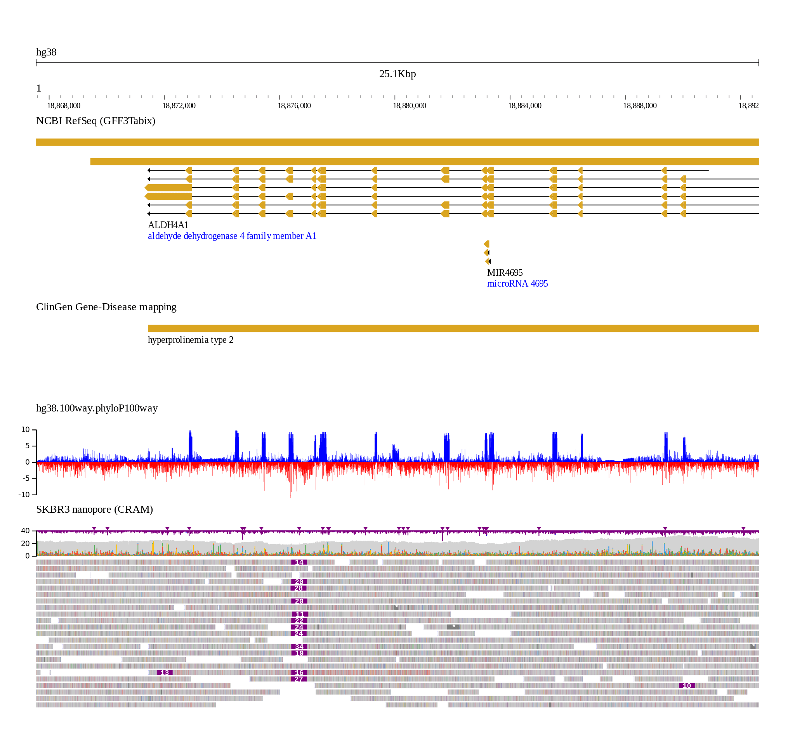

# jb2export

Static exports of JBrowse 2 rendering

## Setup

This example currently uses the export_wiggle_svg branch, and indeed the
rendered output is in svg

Yarn link has trouble so I manually perform builds of the @jbrowse/core and
various plugins and manually copy the results over

```
yarn build&&rm -rf ~/jb2export/node_modules/@jbrowse/core && cp  -R dist ~/jb2export/node_modules/@jbrowse/core

yarn build&&rm -rf ~/jb2export/node_modules/@jbrowse/plugin-linear-genome-view && cp  -R dist ~/jb2export/node_modules/@jbrowse/plugin-linear-genome-view

yarn build&&rm -rf ~/jb2export/node_modules/@jbrowse/plugin-wiggle && cp  -R dist ~/jb2export/node_modules/@jbrowse/plugin-wiggle

yarn build&&rm -rf ~/jb2export/node_modules/@jbrowse/plugin-svg && cp  -R dist ~/jb2export/node_modules/@jbrowse/plugin-svg
```

## Usage

Customize the src/index.js script

Run `yarn test` which builds and runs dist/index > out.svg

Then svg can be manually converted to png

## Example


